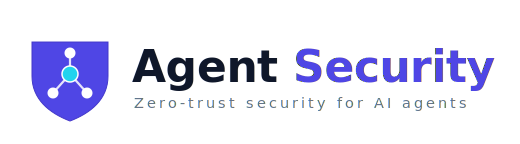

<div align="center">
  
  <p><strong>Open security research on protecting and hardening AI agent systems</strong></p>
  <p>
    <a href="LICENSE"></a>
    
    
    
    
  </p>
  <p>
    <strong>English</strong> ·
    <a href="README.zh-CN.md">中文</a>
  </p>
  <p>
    <a href="zero-trust-for-ai-agents.md">Core framework</a> ·
    <a href="references-and-frameworks.md">External references</a> ·
    <a href="vendor-security-sources.md">Vendor sources</a> ·
    <a href="SKILL.md">Skill</a> ·
    <a href="CONTRIBUTING.md">Contributing</a>
  </p>
</div>

---

> **Open research project**: This is the **self-directed research project of a master's student at the University of Hong Kong (HKU)** — independent, non-commercial, and not affiliated with any vendor mentioned here. **Contributions are welcome** from academia, industry, and the wider community: corrections, additions, and verified new sources are all appreciated.

## Overview

A curated collection of enterprise-grade security frameworks, research, and best practices for protecting and hardening AI agent (agentic AI) systems. It is built on Anthropic's *Zero Trust for AI Agents* and cross-references public research from OpenAI, Google, Microsoft, NIST, MITRE, and OWASP — aiming to be **vendor-neutral with verifiable sources**.

This project helps organizations and developers:

- Understand the security threats facing AI agents
- Protect agent systems with a Zero Trust architecture
- Meet compliance requirements (HIPAA, PCI-DSS, FedRAMP, etc.)
- Build observable, responsive security operations

## Core content

| Document | What's inside |
| --- | --- |
| [zero-trust-for-ai-agents.md](zero-trust-for-ai-agents.md) | The core Zero Trust framework: threat landscape, three-tier architecture, eight-phase implementation, architectural defense against prompt injection, Agentic SOAR, compliance alignment |
| [threat-control-crosswalk.md](threat-control-crosswalk.md) | **The "Rosetta Stone"** — maps each agent threat across OWASP / MITRE ATLAS / CSA MAESTRO / Microsoft taxonomy → ISO 42001 & NIST AI RMF controls → concrete control → validation (work in progress) |
| [references-and-frameworks.md](references-and-frameworks.md) | Vendor-neutral cross-reference of external frameworks and a "threat → framework" mapping (all links verified 2026-06-26) |
| [vendor-security-sources.md](vendor-security-sources.md) | **First-party agent-security source catalog from LLM providers and tech giants**: their frameworks, guardrail products, and open red-team tooling (verified 2026-06-30) |
| [SKILL.md](SKILL.md) | Function and usage as a Claude Skill |
| [templates/](templates/) | Ready-to-use security artifacts (threat model, lethal-trifecta assessment, MCP vetting, egress allowlist) |

## Threat landscape

1. **Prompt Injection** — malicious instructions inserted into inputs/external data to override intended behavior
2. **Tool Poisoning** — compromised external tools returning malicious data or hidden instructions
3. **Identity & Privilege Abuse** — stolen or leaked agent credentials, lateral movement, privilege escalation
4. **Memory Poisoning** — injecting false information into agent memory
5. **Supply Chain Attacks** — components in the agent dependency chain (models, tools, pipelines) being compromised
6. **MCP & Tool Supply-Chain Threats** — tool-description poisoning, rug pulls, confused deputy, token theft

> **Key insight**: Indirect prompt injection has **no reliable "detection/filtering" solution** today. Durable defense is **architectural** — least privilege, isolation, limiting the blast radius (the [lethal trifecta](zero-trust-for-ai-agents.md#defending-against-prompt-injection-architecture-over-detection)). Detection is a supplementary layer only.

## Zero Trust core principles

| Principle | Meaning | Implementation |
| --- | --- | --- |
| Trust Nothing | Assume nothing is secure by default | Cryptographically verify every identity |
| Verify Everything | Validate every operation | Observable logging and audit trails |
| Assume Breach | Design as if already compromised | Engineered isolation and defense |
| Respond at Agent Speed | Match attack speed | Automated threat detection and response |
| Improve Continuously | Keep adapting | Penetration testing and red teaming |

## Three-tier implementation path

| Tier | Timeline | Focus |
| --- | --- | --- |
| **Foundation** | 2–4 weeks | Agent identity & authentication, tool-access logging, input validation, ACLs |
| **Advanced** | 2–3 months | Cryptographic identity (mTLS), task-scoped permissions, memory isolation, behavioral anomaly detection |
| **Optimized** | 3–6 months | Continuous verification, fine-grained context-aware permissions, memory integrity, supply-chain verification, Agentic SOAR |

## References & frameworks

This project cross-references the following public sources (full list and links in [references-and-frameworks.md](references-and-frameworks.md)):

- **Vendors**: Anthropic (Zero Trust for AI Agents), OpenAI (Practices for Governing Agentic AI Systems), Google (SAIF), Microsoft (Taxonomy of Failure Modes in Agentic AI Systems)
- **Standards**: NIST AI RMF / Generative AI Profile, MITRE ATLAS
- **Community**: OWASP Top 10 for LLM Applications, OWASP Agentic AI – Threats and Mitigations
- **Academia**: Greshake et al. (indirect injection), AgentDojo (benchmark), CaMeL (defense by design), Willison (lethal trifecta / Dual-LLM)

## Compliance alignment

| Domain | Frameworks |
| --- | --- |
| AI governance / management system | ISO/IEC 42001:2023 |
| Healthcare | HIPAA |
| Payments / Finance | PCI-DSS, SOX |
| Government | FedRAMP, FISMA |

## Contributing

This project welcomes **publicly released** security research and framework contributions. Workflow:

1. Fork the repository
2. Create a feature branch (`git checkout -b feature/your-feature`)
3. Commit your changes with complete sources and citations
4. Push and open a Pull Request

See [CONTRIBUTING.md](CONTRIBUTING.md). Requirements: content must be publicly released, provide verifiable sources, stay objective and accurate, and follow the existing Markdown style.

## Project structure

```
agent-security-skill/
├── README.md                       Project overview (English, default)
├── README.zh-CN.md                 Project overview (Chinese)
├── SKILL.md                        Skill function and usage
├── zero-trust-for-ai-agents.md     Core Zero Trust framework
├── references-and-frameworks.md    External framework cross-references (verified)
├── vendor-security-sources.md      First-party sources from LLM providers & tech giants
├── CONTRIBUTING.md                 Contribution guide
├── CHANGELOG.md                    Change log
├── LICENSE                         MIT license
├── project.json                    Project metadata
├── templates/                      Ready-to-use security artifacts
│   ├── threat-model-template.md        Agent threat-modeling template
│   ├── lethal-trifecta-assessment.md   Lethal-trifecta quick assessment
│   ├── mcp-server-vetting-checklist.md MCP server vetting checklist
│   └── egress-allowlist.example.yaml   Default-deny egress allowlist sample
├── agent-security-skill.skill      Skill package (ZIP)
└── assets/
    ├── logo.svg                    Project logo (horizontal)
    └── icon.svg                    Project icon (square)
```

## License

This project is licensed under the MIT License — see [LICENSE](LICENSE).

## Contact & support

- 🐛 Issues & suggestions: [Issues](https://github.com/arthurpanhku/agent-security-skill/issues)
- 💬 Discussion & community: [Discussions](https://github.com/arthurpanhku/agent-security-skill/discussions)

---

<div align="center">
  <sub>A self-research project by a master's student at the University of Hong Kong (HKU) · Independent and non-commercial, open to contributions · Based on Anthropic's Zero Trust for AI Agents, cross-referencing multiple public sources</sub>
</div>
